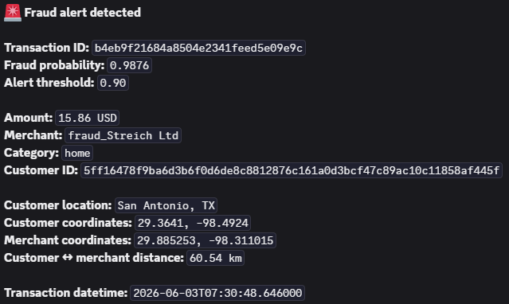

# Automatic Fraud Detection

## 1. Présentation du projet

Ce projet met en place une chaîne automatisée de détection de fraude sur des transactions de paiement.

L’objectif est de construire un pipeline MLOps capable de :

- récupérer régulièrement des transactions depuis une API externe ;
- contrôler la qualité des données entrantes ;
- appliquer un modèle de machine learning versionné dans MLflow ;
- stocker les prédictions, alertes et transactions labellisées dans NeonDB ;
- notifier automatiquement les fraudes détectées via Discord ;
- déclencher un pipeline de réentraînement lorsque suffisamment de nouvelles transactions labellisées sont disponibles ;
- comparer un modèle `challenger` avec le modèle `champion` ;
- promouvoir automatiquement un nouveau modèle si les critères de performance sont satisfaits ;
- historiser les décisions de Continuous Delivery modèle ;
- valider le projet avec Pytest et GitHub Actions.

Le projet est conçu comme une démonstration complète d’un workflow MLOps appliqué à la détection de fraude.

---

## 2. Entraînement initial du modèle

Avant l’automatisation des pipelines Airflow, un premier modèle de détection de fraude est entraîné à partir d’un dataset historique supervisé.

Cette étape permet de disposer d’un modèle de référence initial avant la mise en place du cycle MLOps complet. Le dataset est préparé avec les mêmes règles de preprocessing que celles utilisées ensuite en inférence : nettoyage des variables, création des variables temporelles, calcul de l’âge du client, calcul de la distance entre le client et le marchand, encodage des variables catégorielles et alignement des colonnes attendues par le modèle.

Plusieurs modèles candidats sont entraînés puis comparés. La sélection ne repose pas uniquement sur l’accuracy, peu adaptée à un problème de fraude fortement déséquilibré. Les métriques privilégiées sont notamment l’average precision, le recall de la classe fraude et la precision de la classe fraude au seuil de production.

Le modèle retenu est enregistré dans MLflow Model Registry et associé à l’alias `champion`. Cet alias est ensuite utilisé par le pipeline d’inférence Airflow pour charger dynamiquement le modèle de production.

Les réentraînements ultérieurs suivent la même logique : un nouveau modèle est entraîné comme `challenger`, comparé au `champion`, puis promu uniquement si les critères de performance définis sont satisfaits.

---

## 3. Architecture générale

```
┌──────────────────────────────────────────────────────────────┐
│ 1. Amorçage initial                                           │
└──────────────────────────────────────────────────────────────┘

Dataset historique supervisé
        ↓
Préprocessing + feature engineering
        ↓
Entraînement et comparaison de modèles candidats
        ↓
Sélection du modèle initial
        ↓
MLflow Model Registry
Alias champion


┌──────────────────────────────────────────────────────────────┐
│ 2. Inférence automatisée                                      │
└──────────────────────────────────────────────────────────────┘

API de transactions
        ↓
Airflow - fraud_inference_pipeline
        ↓
Validation métier + Great Expectations
        ↓
Chargement du modèle champion depuis MLflow
        ↓
Prédiction de fraude
        ↓
NeonDB
fraud_predictions
fraud_alerts
labeled_transactions
        ↓
Discord Webhook
si fraude prédite


┌──────────────────────────────────────────────────────────────┐
│ 3. Réentraînement et Continuous Delivery modèle               │
└──────────────────────────────────────────────────────────────┘

Transactions labellisées non intégrées
dans labeled_transactions
        ↓
Seuil MIN_NEW_TRANSACTIONS_FOR_RETRAINING atteint
        ↓
Airflow - fraud_retraining_cd_pipeline
        ↓
Vérification GitHub Actions CI
        ↓
Mise à jour du dataset d'entraînement dans S3
        ↓
Entraînement d'un modèle challenger
        ↓
Comparaison champion / challenger
        ↓
Promotion éventuelle du challenger
        ↓
Mise à jour de l’alias champion dans MLflow
        ↓
Export du modèle promu vers S3
        ↓
Historisation dans NeonDB
model_cd_decisions
```

Une évolution prévue du projet consiste à ajouter un monitoring de drift afin de comparer les nouvelles transactions au dataset de référence, puis d’alerter en cas de dérive significative.

---

## 4. Stack technique

Le projet utilise :

- Python : code métier, preprocessing, entraînement, inférence et tests ;
- Apache Airflow : orchestration des pipelines d’inférence et de réentraînement/CD ;
- Great Expectations : validation des données entrantes ;
- MLflow : tracking des expériences, registry modèle, aliases champion et challenger ;
- NeonDB PostgreSQL : stockage applicatif des prédictions, alertes, transactions labellisées et décisions CD ;
- AWS S3 : stockage des datasets, artefacts modèles et métadonnées de production ;
- Discord Webhook : notification des alertes de fraude ;
- Docker Compose : exécution locale d’Airflow pour la démonstration ;
- GitHub Actions : intégration continue ;
- Pytest : tests automatisés.

---

## 5. Structure du dépôt

```
.
├── dags/
│   ├── fraud_inference_pipeline.py
│   └── fraud_retraining_cd_pipeline.py
│
├── src/
│   ├── api_client.py
│   ├── config.py
│   ├── data_quality.py
│   ├── db.py
│   ├── github_ci.py
│   ├── inference.py
│   ├── mlflow_utils.py
│   ├── model_promotion.py
│   ├── model_schema.py
│   ├── notification.py
│   ├── preprocessing.py
│   ├── train_model.py
│   ├── train_model_candidates.py
│   ├── training_dataset_store.py
│   ├── validation.py
│   └── xcom_utils.py
│
├── sql/
│   └── init_fraud_app_db.sql
│
├── tests/
│
├── .github/
│   └── workflows/
│       └── ci.yml
│
├── docker-compose.yml
├── Dockerfile
├── Dockerfile.airflow
├── requirements.txt
├── requirements-airflow.txt
├── .env.example
├── .gitignore
└── README.md
```

---

## 6. Base de données NeonDB

Le schéma applicatif est défini dans :

```
sql/init_fraud_app_db.sql
```

La base contient quatre tables principales.

```
fraud_predictions
```

Stocke les prédictions générées par le modèle :

        - identifiant de transaction ;
        - montant ;
        - catégorie ;
        - probabilité de fraude ;
        - décision binaire ;
        - seuil de décision utilisé ;
        - nom du modèle ;
        - alias MLflow utilisé ;
        - date de prédiction.
        
```
fraud_alerts
```

Stocke les alertes créées lorsqu’une transaction est prédite comme frauduleuse :

        - identifiant de transaction ;
        - montant ;
        - marchand ;
        - catégorie ;
        - localisation ;
        - probabilité de fraude ;
        - seuil de décision ;
        - canal de notification ;
        - statut de notification ;
        - date de création ;
        - date d’envoi de la notification.

```
labeled_transactions
```

Stocke les transactions labellisées récupérées depuis l’API.

Cette table sert de tampon entre l’inférence et le réentraînement incrémental. Les transactions non encore intégrées au dataset d’entraînement sont identifiées par :

```
integrated_in_training = FALSE
```

Une fois intégrées au dataset S3, elles sont marquées comme intégrées.

```
model_cd_decisions
```

Stocke les décisions de Continuous Delivery modèle :

        - modèle concerné ;
        - version champion ;
        - version challenger ;
        - métriques comparées ;
        - décision de promotion ;
        - raison de la décision ;
        - date de décision.

---

## 7. Pipeline d’inférence Airflow

#### Spécificité du projet : présence du label `is_fraud`

Dans un système de production réel, le label `is_fraud` ne serait pas disponible au moment de l’inférence.  
Il serait obtenu après investigation, retour client, contestation bancaire ou consolidation métier.

Dans ce projet, l’API fournit `is_fraud` dans un objectif pédagogique : simuler un flux supervisé complet permettant à la fois de prédire les transactions entrantes, de stocker des transactions labellisées dans `labeled_transactions`, puis de déclencher un réentraînement incrémental.

La présence de `is_fraud` ne doit donc pas être interprétée comme une donnée connue à l’avance par le modèle en production. Elle sert uniquement au volet labellisation et réentraînement de l’exercice.


#### Le DAG principal d’inférence est :

```
fraud_inference_pipeline
```

Il est planifié toutes les deux heures.

Étapes du DAG

#### A. Récupération des transactions

Le DAG appelle l’API de transactions configurée via les variables d’environnement.

#### B. Validation métier

Les transactions sont contrôlées avant prédiction :

* colonnes attendues ;
* valeurs manquantes critiques ;
* montants négatifs ;
* coordonnées géographiques incohérentes ;
* dates convertibles.

#### C. Validation Great Expectations

Great Expectations vérifie notamment :

* présence des colonnes requises ;
* unicité de `trans_num` ;
* non-nullité des colonnes critiques ;
* validité des coordonnées ;
* validité de `is_fraud` dans le contexte de l'exercice.

#### D. Chargement du modèle MLflow

Le modèle de production est chargé depuis MLflow avec l’alias :

```
champion
```

#### E. Prédiction

Le modèle retourne une probabilité de fraude.

La décision binaire est calculée avec :

```
fraud_probability >= FRAUD_ALERT_THRESHOLD
```

**le modèle ne doit pas utiliser `is_fraud`comme variable explicative.**

#### F. Stockage des prédictions

Les résultats sont insérés dans :

```
fraud_predictions
```

#### G. Stockage des transactions labellisées

Les transactions validées sont insérées dans :

```
labeled_transactions
```

Elles pourront être intégrées au dataset d’entraînement lors du prochain cycle de retraining.

#### H. Création des alertes

Si is_fraud_predicted = 1, une alerte est créée dans :

```
fraud_alerts
```

#### I. Notification Discord

Si le canal configuré est discord, une notification est envoyée via webhook.

Après envoi, l’alerte est mise à jour :

```
notification_status = sent
notified_at = NOW()
```

#### J. Déclenchement conditionnel du retraining/CD

Si le nombre de transactions labellisées non intégrées atteint :

```
MIN_NEW_TRANSACTIONS_FOR_RETRAINING
```

alors le DAG suivant est déclenché :

```
fraud_retraining_cd_pipeline
```

---

## 8. Pipeline de réentraînement et Continuous Delivery modèle

Le DAG de réentraînement/CD est :

```
fraud_retraining_cd_pipeline
```

Il n’est pas planifié automatiquement. Il est déclenché par le DAG d’inférence lorsque le seuil de nouvelles transactions labellisées est atteint.

Étapes du DAG

#### A. Vérification de la dernière CI GitHub Actions

Le pipeline CD ne continue que si la dernière CI GitHub est en succès.

#### B. Récupération des transactions labellisées non intégrées

Le DAG récupère dans NeonDB les lignes de :

```text
labeled_transactions
```

avec :

```text
integrated_in_training = FALSE
```

#### C. Mise à jour du dataset d’entraînement dans S3

Les nouvelles transactions sont ajoutées au dataset d’entraînement traité.

Les transactions déjà présentes dans le dataset ne sont pas dupliquées.

#### D. Marquage des transactions intégrées

Une fois intégrées au dataset S3, les transactions sont marquées comme intégrées dans NeonDB.

#### E. Entraînement du challenger

Le script d’entraînement des modèles candidats est lancé.

Lors du réentraînement, le pipeline ne réentraîne pas uniquement le modèle précédemment retenu. Il relance l’entraînement de plusieurs familles de modèles candidats — régression logistique pondérée, random forest pondérée et XGBoost pondéré — puis sélectionne le meilleur candidat selon l’`average_precision`.

Le meilleur modèle entraîné est enregistré dans MLflow avec l’alias :

```
challenger
```

#### F. Comparaison champion / challenger

Le modèle **challenger** est comparé au modèle **champion**.

Les critères de promotion sont :

* amélioration minimale de average_precision ;
* baisse limitée du recall fraude au seuil de production ;
* precision fraude minimale acceptable.

#### G. Promotion éventuelle

Si le challenger satisfait les critères, il devient le nouveau :

```
champion
```

#### H. Export S3

Le modèle promu et ses métadonnées sont exportés dans S3.

#### I. Historisation de la décision

La décision de CD est insérée dans :

```
model_cd_decisions
```

## 9. Modèle de machine learning

Le projet traite un problème de classification binaire :

```
0 = transaction normale
1 = transaction frauduleuse
```

Le jeu de données initial est fortement déséquilibré. Les métriques utilisées sont donc adaptées à la détection de fraude :

* average_precision ;
* recall de la classe fraude au seuil de production ;
* precision de la classe fraude au seuil de production ;
* comparaison champion / challenger.

Le modèle de production est chargé via MLflow Model Registry avec l’alias :

```
champion
```

Le modèle candidat produit par le pipeline CD est enregistré avec l’alias :

```
challenger
```

## 10. Feature engineering

Les variables utilisées par le pipeline de machine learning incluent notamment :

* montant de transaction ;
* catégorie ;
* informations temporelles ;
* âge du client ;
* distance client ↔ marchand ;
* coordonnées géographiques ;
* variables client et marchand après preprocessing.

La distance client ↔ marchand est calculée à partir des coordonnées GPS.

## 11. Alerting Discord

Le projet envoie une notification Discord lorsqu’une transaction est prédite comme frauduleuse.

Le message contient notamment :

- identifiant de transaction ;
- probabilité de fraude ;
- seuil d’alerte ;
- montant ;
- marchand ;
- catégorie ;identifiant acheteur ;
- localisation acheteur;
- long/lat acheteur ;
- long/lat marchand ;
- distance aheteur-marchand en km ;
- date et heure de la transaction.

Pour éviter les doublons, une alerte est créée uniquement si la transaction n’est pas déjà présente dans fraud_alerts.

La notification est considérée comme envoyée lorsque :

notification_status = sent
notified_at IS NOT NULL

**Exemple d'une alerte Discord :**



---

## 12. Exécution locale avec Docker Compose

Airflow est exécuté localement avec Docker Compose.
Les commandes suivantes sont à saisir dans un terminal Powershell, à la racine du projet où docker-compose est enregistré

**Initialiser Airflow**
```
docker compose up airflow-init
```

**Démarrer les services**
```
docker compose up -d
```

**Vérifier les conteneurs**
```
docker compose ps
```

**Accéder à l’interface Airflow**
```
http://localhost:8080
```

**Identifiants de développement :**
```
admin / admin
```

**Arrêter les services**
```
docker compose down
```

---

## 13. Commandes de test Airflow


**Tester le DAG d’inférence**
```
docker compose exec airflow-webserver airflow dags test fraud_inference_pipeline AAAA-MM-JJ
où AAAA-MM-JJ correspond à une date antérieure ou égale à la date actuelle
```

**Tester le DAG de retraining/CD**

Le DAG de retraining/CD est conçu pour être déclenché conditionnellement par le DAG d’inférence.

Il peut aussi être testé manuellement :

```
docker compose exec airflow-webserver airflow dags test fraud_retraining_cd_pipeline AAA-MM-JJ
où `AAAA-MM-JJ` correspond à une date antérieure ou égale à la date actuelle.
```

---

## 14. Vérifications NeonDB

Quelques requêtes SQL

**Vérifier les alertes**
```
SELECT
    trans_num,
    fraud_probability,
    fraud_alert_threshold,
    notification_channel,
    notification_status,
    created_at,
    notified_at
FROM fraud_alerts
ORDER BY created_at DESC
LIMIT 10;
```

**Vérifier les prédictions**
```
SELECT
    trans_num,
    fraud_probability,
    fraud_alert_threshold,
    is_fraud_predicted,
    model_name,
    model_alias,
    predicted_at
FROM fraud_predictions
ORDER BY predicted_at DESC
LIMIT 10;
```

**Vérifier les transactions labellisées non intégrées**
```
SELECT
    COUNT(*) AS unintegrated_transactions
FROM labeled_transactions
WHERE integrated_in_training = FALSE;
```

**Vérifier les décisions CD modèle**
```
SELECT
    model_name,
    champion_version,
    challenger_version,
    promoted,
    decision_reason,
    decided_at
FROM model_cd_decisions
ORDER BY decided_at DESC
LIMIT 10;
```

---

## 15. Tests automatisés

Lancer les tests localement :

```
pytest -q
```

Le projet contient aussi une CI GitHub Actions.

La CI vérifie notamment :

* installation d’Airflow ;
* installation des dépendances projet ;
* exécution des tests Pytest ;
* imports des modules principaux ;
* compilation syntaxique des DAGs ;
* compilation du script d’entraînement ;
* logique de promotion champion / challenger.

---

## 16. GitHub Actions CI

Le workflow CI est déclenché sur :

```
push sur main
pull_request vers main
```

Le workflow réalise :

* checkout du dépôt ;
* installation de Python 3.11 ;
* installation d’Apache Airflow avec contraintes officielles ;
* installation des dépendances projet ;
* vérification des versions installées ;
* exécution de pytest -q ;
* vérification des imports ;
* compilation des DAGs ;
* vérification de la logique de promotion modèle.

La CI sert de garde-fou avant exécution du pipeline de Continuous Delivery modèle.

---

## 17. Démonstration Discord

Pour la démonstration vidéo, nous avons abaissé temporairement le seuil :

```
FRAUD_ALERT_THRESHOLD=0.00
```
et le minimum de nouvelles transactions labellisées pour déclencher un retraining :

```
MIN_NEW_TRANSACTIONS_FOR_RETRAINING=1
```

Puis recréé les conteneurs :

```
docker compose down
docker compose up -d --force-recreate
```

Les variables ont ensuite été vérifiées dans les conteneurs Airflow : :

```
docker compose exec airflow-webserver printenv | Select-String FRAUD_ALERT_THRESHOLD
docker compose exec airflow-webserver printenv | Select-String MIN_NEW_TRANSACTIONS_FOR_RETRAINING
docker compose exec airflow-scheduler printenv | Select-String FRAUD_ALERT_THRESHOLD
docker compose exec airflow-scheduler printenv | Select-String MIN_NEW_TRANSACTIONS_FOR_RETRAINING
```

puis nous avons manuellement déclenché un DAG d'inférence :

```
docker compose exec airflow-webserver airflow dags test fraud_inference_pipeline AAAA-MM-JJ
```

Après démonstration, nous avons remis les variables à leur valeur normale :

```
FRAUD_ALERT_THRESHOLD=0.90
MIN_NEW_TRANSACTIONS_FOR_RETRAINING=100
```

---

## 18. Idempotence

Le projet limite les doublons sur plusieurs étapes :

* les alertes sont créées uniquement pour les fraudes prédites ;
* les transactions labellisées utilisent ON CONFLICT (trans_num) DO NOTHING ;
* les transactions déjà présentes dans le dataset d’entraînement ne sont pas ajoutées une seconde fois ;
* les alertes Discord ne sont envoyées que pour les nouvelles alertes créées ;
* les transactions intégrées au dataset sont ensuite marquées comme intégrées.

---

## 19. Limites

Le projet présente plusieurs limites :

#### Représentativité des données

Le modèle est entraîné et réentraîné à partir des données disponibles dans le cadre du projet. La qualité du modèle dépend donc directement de la représentativité du dataset historique et des nouvelles transactions labellisées.

Si les comportements de fraude évoluent fortement ou si certaines catégories de transactions sont peu représentées, les performances peuvent se dégrader.

#### Gestion du drift non encore automatisée

Le pipeline compare un modèle `challenger` au modèle `champion`, mais il ne contient pas encore de monitoring automatisé du drift.

Les dérives suivantes ne sont donc pas encore contrôlées automatiquement :

- data drift sur les variables d’entrée ;
- prediction drift sur les scores de fraude ;
- target drift sur le taux de fraude observé ;
- performance drift sur les métriques du modèle après disponibilité des labels.

#### Critères de promotion modèle

La promotion d’un modèle `challenger` repose sur un ensemble limité de métriques principales : `average_precision`, recall fraude et precision fraude au seuil de production.

Ces critères sont cohérents avec un problème de fraude déséquilibré, mais ils pourraient être enrichis par des contrôles complémentaires :

- stabilité des performances par segment ;
- coût métier des faux positifs et faux négatifs ;
- seuils différenciés selon le type de transaction ;
- validation métier avant promotion finale.

#### Orchestration locale

Airflow est exécuté localement avec Docker Compose pour la démonstration. Cette configuration permet de valider l’orchestration complète, mais elle ne correspond pas à une infrastructure Airflow managée ou hautement disponible.

Une mise en production nécessiterait une infrastructure plus robuste : gestion des workers, secrets, logs centralisés, monitoring, sauvegardes et supervision des exécutions.

#### Alerting simplifié

Discord est utilisé comme canal d’alerte démonstratif. Il permet de vérifier que le pipeline déclenche bien une notification en cas de fraude prédite.

Dans un contexte de production, l’alerting devrait être intégré à un système dédié de gestion d’incidents ou de monitoring opérationnel, avec priorisation, acquittement, escalade et suivi des alertes.

---

## 20. Évolutions prévues

#### monitoring de drift : 
```
┌──────────────────────────────────────────────────────────────┐
│ Monitoring futur du drift                                    │
└──────────────────────────────────────────────────────────────┘

Avant disponibilité des labels
        ↓
Nouvelles transactions
+ dataset de référence
        ↓
Data drift
évolution de la distribution des variables d’entrée
        ↓
Prediction drift
évolution de la distribution des scores de fraude


Après disponibilité des labels
        ↓
Transactions labellisées
+ dataset de référence
        ↓
Target drift
évolution du taux de fraude observé
        ↓
Performance drift
dégradation éventuelle des métriques du modèle
        ↓
Rapport de drift
        ↓
Alerte si dérive significative
```

Le monitoring de drift n’est pas encore implémenté dans le pipeline actuel, mais il constitue une évolution naturelle du projet.

Il doit distinguer les contrôles réalisables avant l’arrivée des labels et ceux réalisables uniquement après labellisation.

 **Avant disponibilité de `is_fraud`**, il est possible de surveiller le data drift sur les variables d’entrée et le prediction drift sur les scores produits par le modèle.
 
 **Après disponibilité des labels**, il devient possible de mesurer le target drift, c’est-à-dire l’évolution du taux de fraude observé, ainsi que le performance drift, c’est-à-dire la dégradation éventuelle des métriques du modèle.

Cette séparation est importante car, dans un système réel, le label de fraude ne serait disponible qu’après investigation, contestation ou consolidation métier.

#### Séparation stricte des flux labellisés et non labellisés

Dans le projet actuel, l’API fournit `is_fraud` afin de simuler un flux supervisé complet. Une évolution possible serait de séparer plus strictement deux flux :

- un flux d’inférence temps réel sans label ;
- un flux différé de transactions labellisées utilisé pour le réentraînement.

Cette séparation serait plus proche d’un fonctionnement de production, où le label de fraude n’est disponible qu’après un délai métier.

#### Élargissement des modèles candidats

Le pipeline actuel réentraîne et compare plusieurs modèles candidats : régression logistique pondérée, random forest pondérée et XGBoost pondéré.

Une évolution possible serait d’élargir cette recherche à d’autres familles de modèles afin d’améliorer la détection de fraude, notamment si le volume de données augmente ou si les comportements frauduleux deviennent plus complexes.

Des pistes possibles seraient :

- tester d’autres familles d'algorithmes ;
- optimiser plus finement les hyperparamètres des modèles existants ;
- tester des stratégies de calibration des probabilités ;
- évaluer des modèles spécialisés dans les données fortement déséquilibrées ;
- comparer plusieurs seuils de décision selon le coût métier des faux positifs et faux négatifs ;
- tester des modèles segmentés selon certaines catégories de transactions.

Cette évolution devrait rester encadrée par la logique `champion` / `challenger` déjà présente : un nouveau modèle ne devrait être promu que s’il améliore les métriques principales sans dégrader excessivement le recall fraude ou la precision fraude au seuil de production.

#### Industrialisation de l’orchestration

Airflow est exécuté localement avec Docker Compose pour la démonstration.

Une évolution de production consisterait à déployer l’orchestration sur une infrastructure plus robuste, avec gestion centralisée des secrets, supervision des exécutions, logs centralisés, sauvegardes, alerting technique et séparation claire des environnements de développement, test et production.

#### Dashboard de suivi Streamlit

Une évolution possible serait d’ajouter un dashboard Streamlit connecté à NeonDB afin de visualiser les résultats du pipeline d’inférence et de faciliter le suivi opérationnel de la fraude.

Ce dashboard pourrait présenter plusieurs indicateurs métier :

- volume de transactions analysées sur une période donnée ;
- nombre et taux de fraudes prédites ;
- évolution du taux de fraude dans le temps ;
- montants associés aux transactions frauduleuses détectées ;
- estimation des montants de fraude évités ;
- répartition des fraudes par catégorie de transaction ;
- marchands ou catégories les plus exposés ;
- régions ou États des consommateurs les plus concernés ;
- régions ou États des marchands les plus concernés ;
- évolution des alertes Discord envoyées ;
- suivi du statut des alertes : créées, envoyées, échouées.

Le dashboard pourrait également intégrer une vue MLOps :

- modèle actuellement utilisé en production ;
- alias MLflow actif ;
- seuil de décision configuré ;
- distribution des scores de fraude ;
- volume de transactions labellisées disponibles pour le réentraînement ;
- historique des décisions `champion` / `challenger` ;
- visualisation des principaux indicateurs de drift lorsque le monitoring sera ajouté.

Cette interface permettrait de compléter l’alerting Discord, qui reste centré sur les alertes unitaires, par une vision agrégée de l’activité fraude et de la stabilité du système.